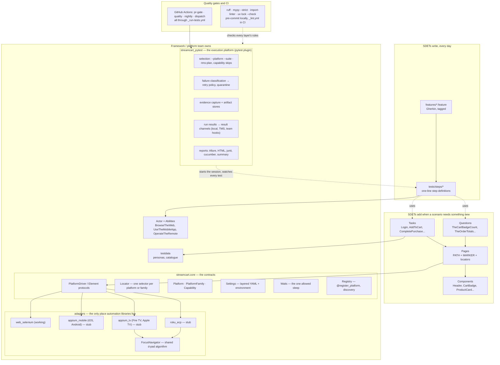
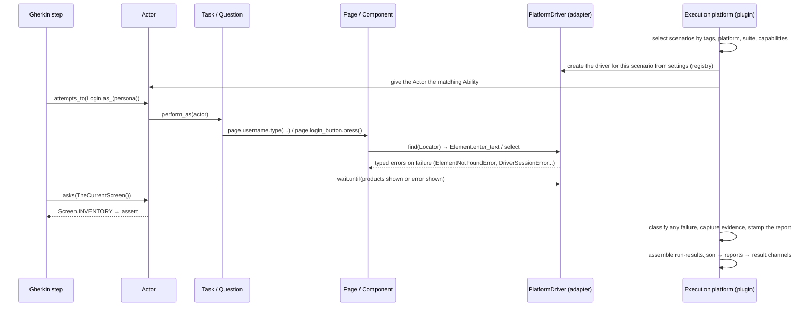

# Architecture Decision Record — StreamCart QA framework

**Status:** accepted · **Scope:** the multi-platform test automation framework for StreamCart
(Web, iOS, Android, Fire TV, Roku, Apple TV). Implemented and verified for Web against SauceDemo.

This record follows the seven questions in the assessment. For each decision it gives the
situation, the alternatives I looked at, and why I chose what I chose. Two extra sections at the
end describe how the framework was built and what its own tests prove. The design is built on the
end-to-end features I have used in previous experience; each was discussed, considered, and kept
or rejected after evaluation against the requirements here. AI was used for analysis,
brainstorming and generating code, but the design principles, the decisions, the framing of the
prompts and the filtering of the output are mine.

A few terms used throughout:

- **Platform** — a product target: `web`, `ios`, `android`, `firetv`, `roku`, `appletv`. Each belongs
  to one **family** (web, mobile or tv), which is how the user interacts with it.
- **Target** — *where* a run executes: a file in `config/target/` such as `chrome`, `edge`,
  `chrome-grid`, `browserstack`, `pixel7-lab`, `roku-lab`. For web targets the browser is part of it.
- **Environment** — *what* a run tests against: `config/env/dev.yaml`, `staging.yaml`, `prod.yaml`.
- **Capability** — something a platform can do (`HOVER`, `SWIPE`, `DPAD`, `KEYBOARD`...), declared
  by its adapter and used to skip scenarios a platform cannot run.
- **Adapter** — the one module per automation technology (Selenium, Appium, Roku's HTTP protocol)
  that talks to the real browser or device. Everything else talks to adapters through one protocol.
- **Screenplay** — a way of writing tests around an *Actor* who performs *Tasks* and asks
  *Questions*, instead of calling page-object methods directly.
- **Run results** — `run-results.json`, the record of one run that every report and every
  integration is built from.
- **Result channel** — a place a finished run is published to: the local results file, a
  test-management system, a team's chat or dashboard.

---

## 1. Framework and library selection

| Concern | Decision | Alternatives to probe | Why chosen |
|---|---|---|---|
| Test runner | **pytest** | Robot Framework; unittest; Behave as a runner | pytest is required by the brief, and it would be my choice anyway. **pytest vs Robot Framework:** Robot is keyword-driven with its own runner, its own file format and a listener API; the test logic lives in keyword libraries that are harder to type-check and debug than plain Python. pytest gives fixtures, markers, `-k`/`-m` selection and plugin hooks, so the whole execution layer (selection, classification, retries, reports) is a pytest plugin rather than a wrapper around the runner. **pytest vs unittest:** no fixtures, no markers, no plugin ecosystem (xdist, rerunfailures, pytest-bdd, Allure). **pytest vs Behave:** Behave is a runner of its own; using it would mean losing the pytest ecosystem and writing the plugin twice. |
| Web automation | **Selenium 4** (Selenium Manager, so no driver installs) | Playwright | **Selenium vs Playwright:** Playwright is faster and waits automatically, but it is web-only and has its own page/locator model. Five of StreamCart's six platforms are driven by WebDriver-style tools (Appium for mobile and TV, Roku's HTTP protocol), and Selenium Grid is the infrastructure a device lab already uses. One driver protocol that fits all six platforms is natural on Selenium and awkward on Playwright. For a web-only product, Playwright. |
| Mobile and TV | **Appium** (UiAutomator2 / XCUITest); **Roku over plain HTTP** (standard library, no client package) | the Appium Roku driver | Appium is the only realistic choice for iOS, Android, Fire TV and Apple TV. **Roku direct vs the Appium Roku driver:** driving Roku over its own HTTP protocol removes a dependency and proves the driver protocol is not tied to WebDriver at all — no session object, an XML view tree, d-pad focus — yet it fits the same interface as Chrome. |
| How tests are written | **pytest-bdd** (Gherkin) as the *only* way product tests are written | Behave; plain pytest; data-driven tables | **pytest-bdd vs Behave:** same Gherkin, but pytest-bdd keeps pytest's fixtures, selection, xdist and our plugin; Behave is a second runner. **Gherkin vs plain pytest:** product owners can review a feature file, and its tags (`@TC-...`) are the link to the test-management system; a pytest function is neither. Plain pytest is used only for the framework's own tests. |
| Business layer | **Screenplay** (Actor, Ability, Task, Question) on top of small Pages and Components | classic page objects with flow methods; a keyword layer | See section 4. |
| Configuration | **pydantic-settings** with layered YAML | dynaconf; a plain YAML loader; `.ini` files | **pydantic-settings vs dynaconf / plain YAML:** typed and validated settings — an unknown key is an error, not a silent default; secret fields never print; and environment variables map onto nested settings (`STREAMCART_TMS__UPLOAD` → `settings.tms.upload`), so one set of names works in `.env`, compose and GitHub Secrets. dynaconf does layering but not typing; plain YAML does neither. |
| Reports | **Allure** (allure-pytest-bdd plus the CLI), **pytest-html**, junit, cucumber.json, and our own **run results** | Allure only; pytest-html only | Different people read different reports (see `docs/reports.md`): Allure for product owners, pytest-html for engineers, junit for CI, cucumber.json for test-management import. `run-results.json` is the stable format integrations consume; the other files are views of it. |
| Parallel runs | **pytest-xdist**, plus **pytest-split** for shards in CI | pytest-parallel | **xdist vs pytest-parallel:** xdist is maintained, works with every plugin here, and isolates by process. One browser session per scenario, one run id shared by all workers, results collected on the controller — no worker files to merge. |
| Retries | **pytest-rerunfailures**, limited by failure category and **configurable** | a blanket `--reruns 2`; no retries | **Category-gated vs blanket retries:** a blanket retry hides real defects and doubles the cost of every genuine failure. By default only environment failures (a lost session, an unreachable app) are retried once. A team can widen this — `--retry-categories environment,product` — for UI suites where timing-sensitive product failures are worth one more attempt. In every case a pass on retry is reported as **flaky**, never as a plain pass. |
| Packaging | **uv** with `uv.lock`; pip still works from the same `pyproject.toml` | pip with `requirements.txt`; Poetry | **uv vs pip:** pip has no real lockfile — `pip freeze` captures one machine, so an Ubuntu runner can resolve differently from a Windows laptop; uv's lockfile is resolved for every supported OS and Python at once, and installs are 10–100× faster (seconds per CI job). **uv vs Poetry:** Poetry also locks, but its resolver is slow, it does not manage Python versions, and it needs its own project format; uv reads standard `pyproject.toml`, installs Python, and `uv lock --check` catches drift in CI. Reviewers without uv run `pip install -e ".[dev]"`. |
| Code quality | **ruff** (including banned imports), **mypy --strict**, **import-linter**, **pre-commit** | flake8 + isort + black | **ruff vs flake8 + isort + black:** one tool, much faster, same rules — and ruff's `banned-api` turns "no `time.sleep`, no Selenium outside adapters" into build failures. import-linter turns the layer diagram into a rule the build checks. |
| Test data | YAML for reference data; Gherkin tables for scenario data; environment variables for secrets | fixtures with literal values; generated data (Faker) | Reference data (personas, the catalogue) is versioned with the tests; scenario data is visible in the feature file; secrets never touch the repository. Generated data was considered and rejected: shipping details that change on every run make a failing scenario harder to reproduce and hide nothing useful. See section 5. |

---

## 2. Architecture overview



**The dependency rule.** `streamcart_pytest → screenplay → ui | testdata → core`. Selenium and
Appium may only be imported inside `core/driver/adapters/`. Nothing in `streamcart` imports the
plugin. These are not conventions: import-linter checks them, a framework test runs import-linter,
and a dependency in the wrong direction fails the build.

**One scenario, step by step:**



1. pytest-bdd turns the Gherkin scenario into a test function. The plugin reads its tags and
   decides, while collecting, whether it belongs in this run: a `@roku`-only scenario is left out
   of a web run; a `@requires:swipe` scenario is kept but skipped with a reason.
2. The `driver` fixture builds the platform driver from the settings (through the registry) and
   hands the Actor the matching Ability: `BrowseTheWeb`, `UseTheMobileApp` or `OperateTheRemote`.
3. Steps call `attempts_to(Task)` or `asks(Question)`. Tasks drive Pages and Components; those
   resolve Locators through the driver.
4. When the test ends, the plugin classifies any failure from the exception type, captures
   evidence through the driver, and attaches the result to pytest's report object so it travels to
   the xdist controller.
5. The controller assembles **`run-results.json`**: the one file every report and every result
   channel is derived from.

**Run identity.** The run id (from `--run-id`, `STREAMCART_RUN_ID`, or generated) is shared by
every xdist worker and every CI shard of a run. It appears in every log line and in every
artifact path (`<team>/<env>/<platform>/<run-id>/...`).

**The report always describes the target it ran on.** A *target* (`config/target/chrome.yaml`,
`edge.yaml`, `firefox-grid.yaml`, `browserstack.yaml`, `roku-lab.yaml`...) says where a run
executes, and for web targets the browser is part of that choice. A target named after a browser
runs that browser; the framework refuses a configuration that overrides `web.browser` underneath
it (`--target chrome` with `web.browser=edge` is an error that tells you to use `--target edge`).
Every report and the Allure environment panel show the target, the browser and the configuration
files that were loaded, so nobody has to guess what a result applies to.

---

## 3. Platform abstraction strategy

**The axis is how the user interacts, not which device they hold.** `PlatformFamily` is a fixed
set of three: *web* (pointer and keyboard, URLs), *mobile* (touch and gestures), *tv* (a remote
control and a focus indicator). A family is fixed because it implies its own Screenplay Ability
and its own locator conventions. A `Platform`, on the other hand, is open: it is a small value
object **declared by the adapter that drives it** — `Platform("roku", PlatformFamily.TV,
default_target="roku-lab")` — and registered with `@register_platform`. The core keeps no list of
platforms; the registry discovers adapters in the adapters package and in the
`streamcart.platforms` entry-point group. That is what makes "adding a platform changes no
existing file" something the test suite can prove rather than a claim.

**One protocol, named after intent.** `PlatformDriver` has `open`, `find`, `find_all`,
`is_present`, `wait_until`, `press`, `hover`, `swipe`, `long_press`, `screenshot`, `page_source`
and `console_logs`; `Element` has `select`, `enter_text`, `text`, `is_displayed` and `find`. The
words are deliberately not Selenium's: `select` rather than click, `enter_text` rather than
send_keys. The name says what the user does; the adapter decides how. Code that *uses* a driver
type-hints against the Protocol (any object with those methods qualifies, so tests never inherit
from anything); code that *implements* a driver extends `BaseDriver` to get capability checks,
the configured waiter and safe defaults.

**How a click, a tap and a d-pad press differ, without the Task knowing:**

| Family | `select()` means | `enter_text()` means | `open()` means | How elements are found |
|---|---|---|---|---|
| web (Selenium) | a pointer click | `send_keys` into a focused input | navigate to `base_url + path` | `data-test` attributes through `By.TEST_ID`; CSS or XPath where needed |
| mobile (Appium) | a tap | type on the on-screen keyboard | a deep link `streamcart://...` | accessibility id, resource id |
| tv (Appium or Roku ECP) | **move the focus with the d-pad until this element has it, then press OK**. The algorithm (`FocusNavigator`) is shared by Fire TV, Apple TV and Roku and unit-tested without a device | focus the field, then type with remote keys | launch the channel with a content id (Roku) or a deep link | accessibility id, text, the SceneGraph XML |

**Capabilities are declared, never guessed.** Each adapter lists what its platform can do
(`HOVER`, `SWIPE`, `DPAD`, `KEYBOARD`, `SCREENSHOT`, ...). A Task can require a capability
(`Login.submitting_with_the_keyboard()` needs `KEYBOARD`); a scenario can be tagged
`@requires:swipe`. Where the platform cannot provide it, the scenario is skipped *with the reason
in the report*. And `BaseDriver` fails loudly if an adapter declares a capability it did not
implement. *What I rejected:* `if platform == "roku"` branches inside Tasks. They multiply without
limit, cannot be tested, and are the first thing a growing team copies.

**How a locator finds the right selector, automatically.** A `Locator` is a name plus a small
table of selectors, keyed by *platform* (`roku=`), *family* (`web=`, `mobile=`, `tv=`) or `any=`:

```python
CHECKOUT = Locator.define("checkout button",
                          web=By.TEST_ID("checkout"), tv=By.TEXT("Checkout"), roku=By.ID("checkoutBtn"))
LOGIN = Locator.test_id("login button", "login-button")   # shorthand for any=By.TEST_ID("login-button")
```

When a Page asks the driver for an element, the adapter calls `locator.for_platform(platform)`.
The lookup order is: **the platform's own key → its family key → `any`**. So `CHECKOUT` resolves
to `By.ID("checkoutBtn")` on Roku, to `By.TEXT("Checkout")` on Fire TV (family `tv`), and to
`By.TEST_ID("checkout")` on web. The adapter then turns the selector into its native form:
`By.TEST_ID("x")` becomes `[data-test="x"]` in the browser, the accessibility id on mobile, the
node id on Roku. A Page never mentions a platform, and a new platform usually needs no new
selectors, because its family key already matches. When nothing matches, the adapter raises a
typed `LocatorNotDefinedError`, reported as a *ui-contract* failure. *Rejected:* one locator file
per platform per page — six files to keep in sync for every element.

**Locator strategy: the `data-test` attribute first.** SauceDemo, like StreamCart, marks its
interactive elements with `data-test` attributes. They are the most stable handle a test can
have — they do not change when styling, layout or copy changes — so `By.TEST_ID` is the default
selector on web, and the attribute name is a setting (`web.test_id_attribute`) for products that
call it `data-testid` or `data-qa`. CSS and XPath are the fallback for elements without one
(list items, prices). Every locator lives on the Page or Component it belongs to, with a human
name, and a framework test checks that each one has a selector for the implemented platform.
There is no separate locator registry: the Pages *are* the inventory, reviewed screen by screen.

**The stubs are real signatures, not empty files.** `appium_mobile` (one adapter for iOS and
Android, because the Appium client is the same and the differences are data), `appium_tv` (Fire
TV and Apple TV, remote-control semantics) and `roku_ecp` each declare their platforms, their
capabilities and their selector mappings, and their bodies contain the calls a working
implementation makes. The Appium client is imported lazily, so the web suite installs and runs
without it. They have not been executed against a device in this assessment, and their docstrings
say so.

---

## 4. Page Object design

**A hybrid: Screenplay on top of small Pages and reusable Components.**

- A **Page** is one screen: its `PATH`, a `MARKER` element that proves the screen is showing, and
  its locators. A **Component** is a reusable piece of UI with an optional root: screen-level
  (`Header`), rooted by a locator (`ErrorBanner`), rooted by an element (`ProductCard`, one item of
  a list), or scoped inside another element. Roots are looked up fresh on every access, so a React
  re-render never hands a Task a stale element. Pages and Components expose simple actions
  (`press`, `type`, `text`, `is_displayed`) and contain **no assertions and no flows**.
- A **Task** is something the user does, written in product language: `Login.as_(persona)`,
  `AddToCart.item("Sauce Labs Backpack")`, `CompletePurchase`. Tasks compose Pages and Components
  and **wait for the screen to settle** — `Login` waits for either the products or an error — so a
  step never waits.
- A **Question** returns a typed answer: `TheOrderTotals()` returns an `OrderTotals` with
  `Decimal` fields; `TheCurrentScreen()` returns a `Screen` enum. Assertions live in step
  definitions and nowhere else.
- A **step definition is one line**: one `attempts_to`, or one `asks` followed by an assertion.
  If a step needs more, the missing piece is a Task or a Question.

*Why not classic page objects with flow methods?* Methods like
`login_page.login_and_go_to_inventory()` grow into a second API shaped like pages, and every SDET
extends it differently. Screenplay gives the team a single way to compose behaviour and keeps
Pages small enough to be written from a screen's markup. *Why no separate Interaction classes, as
in textbook Screenplay?* Pages and Components already provide the primitives, so
`Click.on(LOGIN_BUTTON)` objects would duplicate them; a Task calls `page.login_button.press()`
directly. *Why not Screenplay without Pages?* Locators need a home that can be reviewed per screen
and per platform. A Page is that home.

**How it scales.** New behaviour means a feature file, a few one-line steps, usually one Task and
one Question, and locators on the Page they belong to. UI that appears everywhere — the header,
the cart badge, the menu, the sort control, the error banner, the order summary — is a Component
used by every Page, so a product change to the header is one edit. A framework test walks every
Page and Component and fails the build on an unknown platform key or a locator with no web
selector.

---

## 5. Test data management

Three kinds of data, three homes, on purpose:

| Kind | Where it lives | The rule |
|---|---|---|
| **Secrets** — passwords, tokens, cloud-grid keys | the environment only: `.env` locally (gitignored), GitHub Secrets in CI, `environment:` in compose | Secret fields never print. `.env.example` lists every name. One framework test scans every tracked file for the SauceDemo password; another proves every `STREAMCART_*` name used by CI or compose maps to a real setting. |
| **Reference data** — personas, the product catalogue, the tax rate | `data/users.yaml` and `data/products.yaml`, versioned with the tests | This is the oracle, and it is the same on every platform. "The catalogue shows every product with its details" compares the screen with the catalogue; the order-overview scenario recomputes item total, tax and grand total from it. Prices are strings in YAML so they load as exact decimals. |
| **Scenario data** — which persona, which product, shipping details | Gherkin `Examples` tables and step arguments | Visible in the feature file, where reviewers read it. No hidden fixtures, no generated values: a failing scenario reproduces with exactly the data in the file. |

**Isolation.** Every scenario gets its own browser session (the `driver` fixture is per test) and
its own Actor; `ResetAppState` exists as a Task; there is no module-level state anywhere (ruff and
the architecture tests keep it that way). In parallel runs, workers never share a session. In CI,
every shard of a run shares the run id but writes its own `run-results.json`, merged afterwards.

**Across platforms.** Personas and the catalogue are the same everywhere. Only *how* a persona
signs in differs, and that lives in the adapter. Platform-specific behaviour is expressed in
Gherkin with `@web` / `@roku` tags or `@requires:` capabilities, never with data.

**Across runs.** Results are keyed by `(team, platform, target, env, run id)`. The same test
case run on Chrome and on Firefox, against staging and against production, produces distinct
executions in the test-management system; retries inside one run are attempts of one result.

---

## 6. Team scaling

**Ten SDETs writing tests every day.** The answer is conventions that tools enforce, so reviews
can focus on behaviour:

- *One way to write a test.* Product behaviour is Gherkin plus one-line steps. Tags are a single
  vocabulary — `@smoke` / `@regression` / `@e2e`, `@web` / `@roku` / ..., `@critical`, `@slow`,
  `@quarantine`, `@known_issue:TICKET`, `@requires:cap`, `@TC-...` — and that vocabulary drives
  selection, skipping, retries, reporting and the link to test management. Nobody writes a pytest
  marker by hand.
- *Small files with clear owners.* One feature file and one step module per functional area.
  Tasks and Questions grouped the same way. One Page per screen; Components shared. Two people
  adding scenarios in different areas never touch the same file, which is where merge conflicts
  come from.
- *Guardrails that fail the build, not the review.* `time.sleep` and Selenium imports outside
  their one allowed place are lint errors. Layer violations fail `lint-imports`. `mypy --strict`
  covers everything. The architecture tests fail on a platform name in the core, a locator without
  a web selector, or a platform without its configuration files, and the guardrail tests prove the
  bans actually bite. `pre-commit install` runs all of it locally; the PR gate runs it in under
  ten minutes.
- *Onboarding.* A new SDET reads `docs/writing-scenarios.md`, writes a scenario, runs it with
  `pytest -k`, and opens `report.html`. Their first Task is a 20-line class built from primitives
  they can see on a Page.
- *Review.* Product owners review feature files. SDETs review Tasks and Questions. The
  architecture owner reviews Pages (locators) and anything under `core/`. Failure categories make
  triage a routing decision: *product* goes to the developer, *ui-contract* to the page's owner,
  *environment* to infrastructure, *test-defect* back to the author.

**Fifty SDETs.** The same rules, plus structure the framework already allows for:

- *Platform teams own adapters.* A platform is new files only. A team can even ship its adapter
  as a separate package, registered through the `streamcart.platforms` entry point, on its own
  release cadence.
- *Selection grows with the organisation.* Suites, platforms, capabilities, test-management
  plans (`--tms-plan`) and shards (pytest-split, balanced by recorded durations) keep a
  hundred-scenario PR gate under ten minutes while the nightly run covers every browser and device.
- *The run results are the integration contract.* Test-management adapters (Xray, codeBeamer),
  artifact stores (local, S3, Azure Blob) and team channels (the `pytest_streamcart_result_channels` hook
  in a `conftest.py`) all consume `run-results.json`. A dashboard, a chat notifier or a data-lake
  feed is a result channel, not a framework change.
- *Flakiness is a category, not folklore.* A pass on retry is *flaky* in every report and in the
  test-management system. Which failures may be retried is a setting the team owns. Trends across
  runs belong to the CI analytics or the TMS that receive every run. Quarantine is a reviewed tag
  in the feature file.
- *Ownership and cadence.* CODEOWNERS per area: features and steps by product area, `ui/` by
  screen owner, `core/` and `streamcart_pytest/` by the platform team. The framework's own tests
  (`tests/framework`, reported separately) are the contract the platform team keeps green for
  everyone else.

---

## 7. Trade-offs and limitations

What was left out or simplified on purpose, and what two more weeks would buy:

- **Only Web executes.** The mobile and TV adapters are honest stubs: real signatures, real
  capability declarations, real selector mappings, never run against a device. *Two weeks:* run
  `appium_mobile` against an Android emulator in CI (the device-lab matrix and the Appium settings
  already exist) and `roku_ecp` against a sideloaded channel.
- **SauceDemo is every environment.** `config/env/dev.yaml`, `staging.yaml` and `prod.yaml` all
  point at SauceDemo. The layering is exercised — the header shows which files loaded — but the
  environments do not actually differ.
- **Chrome on the company-managed laptop could not be verified the normal way.** The Chrome on
  my work laptop is controlled by the organisation's policies. After a short idle period it
  silently discarded the clicks and keystrokes that Selenium sent: ChromeDriver reported success,
  but the page never received the event. Edge on the same laptop, Chrome in a Selenium Grid
  container and Chrome on GitHub's runners do not have this problem, so it is an environment
  failure of that one machine, not a product or framework problem. To be able to verify the suite
  on Chrome at all, the web adapter now checks that every click and keystroke actually arrived; if
  it did not, it sends the same click or text once more through the page's own DOM event API, in
  the same session, and counts it as an *environment* signal in the run summary (`environment: browser dropped N input event(s)`). On a healthy
  browser this code never runs (zero on Edge, zero on Grid). It is extra machinery that a team on
  normal infrastructure may prefer to remove; it lives in one adapter.
- **The Allure HTML needs the Allure CLI (Java).** Results are always written; the HTML is
  rendered when the CLI is present (CI installs it; locally the summary prints the `allure serve`
  command otherwise).
- **pytest-bdd naming for scenario outlines.** Parametrised scenarios show pytest-style ids in
  `pytest -v`; Allure and cucumber.json show the Gherkin names.
- **A separate configuration repository** (one platform serving several product repositories)
  was considered and noted as the growth path. For one product, in-repo layering is right.
- **Budget choices.** No visual testing, no accessibility checks, no API-level setup of cart
  state (SauceDemo has no API). Each is a Task or a result channel away. A `--headed` mode exists
  for debugging; a step-through debugger does not. Cross-run flakiness trends are left to the
  systems that receive every run; *two weeks:* an Allure TestOps or ReportPortal channel.

One thing I would change if I started over: verify from a clean clone on day one. My working copy
hid the fact that the assignment's `.gitignore` pattern `env/` also ignored `config/env/` — the
environment layer. A fresh clone found it, and a one-line fix corrected it. It is now part of the
release checklist: the README quick start is executed from a clean clone with both `uv` and `pip`.

---

## 8. How the framework was built

The framework was built design-first, with an AI pair-programmer working under my direction. I
set the architecture, the constraints and the proof each layer had to pass; the assistant drafted
code and tests to those constraints; every layer was run, reviewed and corrected before the next
one started. Several of the assistant's proposals were rejected along the way — a fixed `Platform`
enum, an executor script wrapping pytest, generated test data. Speed of generation was never the
point. The point was to spend the time on decisions, guardrails and verification — the things
this record is about — and to be able to explain every file.

## 9. What the framework proves about itself

`pytest tests/framework` — 156 tests, reported separately from product runs:

- **Architecture.** Automation libraries are imported only by adapters. The core names no
  platform. *Adding a platform requires new files only*: a made-up platform is registered,
  configured, created and located without editing anything. Every registered platform ships its
  configuration files. Every UI locator uses known keys and covers web.
- **Guardrails.** `time.sleep` and Selenium imports are lint errors where they must be. The
  layer rules hold. Every `STREAMCART_*` variable used in CI or compose maps to a setting. No
  credential is committed. The browser is part of the target: overriding it underneath a
  browser-named target is refused.
- **The execution platform**, in isolated pytest sessions: failures are classified and
  `run-results.json` is written; only the configured categories are retried (environment by
  default, more when a team opts in); a pass on retry is flaky in the run results, the HTML, junit,
  the summary and Allure; evidence is captured from the driver on failure; framework runs never
  touch product result channels.
- **The contracts.** Configuration precedence and secrets; the registry and capability checks;
  locator resolution; waits; d-pad focus navigation; the Screenplay core; Gherkin tag mapping and
  selection; the test-management adapters and artifact stores — plus browser-backed integration
  tests of the web adapter, the UI model and the Screenplay layer.
