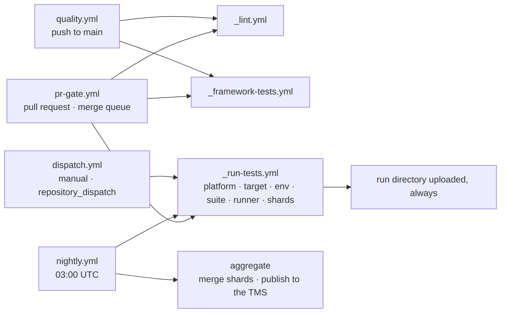

# Pipeline strategy — StreamCart QA

The pipeline is three reusable templates and four workflows that call them. Every test run, on
any platform, goes through the same template; the caller only decides *what* runs, *where* and
*when*.



| Workflow | When | What runs | Budget |
|---|---|---|---|
| `pr-gate.yml` | every pull request, merge queue | `_lint` → `_framework-tests` (Ubuntu) → the **smoke** suite on headless Chrome, in parallel | under 10 minutes end to end |
| `quality.yml` | push to `main` | `_lint`, and `_framework-tests` on Ubuntu and Windows × Python 3.10 and 3.12 | about 5 minutes per cell |
| `nightly.yml` | 03:00 UTC, or by hand | web: Chrome, Firefox and Edge × 2 shards on `staging`; the device lab (when one exists); the containerised Grid path; then one aggregation job | about 20 minutes wall clock |
| `dispatch.yml` | the Actions UI (dropdowns), or a `repository_dispatch` event named `streamcart-run` sent by another pipeline | anything: platform, target, env, suite, TMS plan, workers, runner, extra arguments | the caller decides |

The templates: `_run-tests.yml` is the single entry point for executing tests. `_lint.yml` runs
`uv lock --check`, ruff, ruff format, mypy --strict and import-linter. `_framework-tests.yml`
runs the framework's own tests on any OS and Python version. A composite action,
`.github/actions/setup`, installs the locked dependencies with uv (cached by `uv.lock`) and puts
the environment on `PATH`, so every later step is a plain `pytest ...` or `ruff ...` command.

## What one test job does

1. **Install.** `uv sync --frozen` — a few seconds, cached. Browsers come with the GitHub-hosted
   image; Selenium Manager fetches the driver.
2. **Run headless.** `pytest tests/steps --platform web --target chrome --env dev --suite smoke -n auto`.
   The `chrome` target is headless by definition; nothing in CI ever passes `--headed`. Shards add
   `--splits N --group i --durations-path tests/.test_durations` (pytest-split balances them by
   recorded durations). A TMS plan adds `--tms-plan KEY`.
3. **Report.** The run folder receives `report.html`, `junit.xml`, `cucumber.json`,
   `allure-results/` (and `allure-report/index.html`, rendered by the Allure CLI in the next step),
   `run-results.json`, `summary.md`, and `artifacts/<test>/` with a screenshot, the page source and the
   console log for every failure.
4. **Upload, always.** `if: always()`, named `reports-<platform>-<target>-<env>-shard<i>`, kept for
   30 days. The pytest exit code is the job's verdict; nothing is swallowed.

Secrets and variables map one-to-one onto settings: `secrets.SAUCE_PASSWORD` →
`STREAMCART_USERS__DEFAULT__PASSWORD`, `secrets.TMS_TOKEN` → `STREAMCART_TMS__TOKEN`,
`vars.TMS_PROVIDER` / `TMS_BASE_URL` / `TMS_PROJECT_KEY` → `STREAMCART_TMS__*`, `github.sha` →
`STREAMCART_BUILD`. A framework test fails if a `STREAMCART_*` name used by any workflow or by
compose has no matching setting, so the pipeline cannot silently set something the code ignores.

## Extending to mobile and TV

Same template, three inputs different:

```yaml
- { platform: android, target: pixel7-lab,  runner: '["self-hosted","android-lab"]' }
- { platform: firetv,  target: firetv-lab,  runner: '["self-hosted","android-lab"]' }
- { platform: roku,    target: roku-lab,    runner: '["self-hosted","roku-lab"]' }
- { platform: ios,     target: iphone-sim,  runner: '["self-hosted","macos-lab"]' }
- { platform: appletv, target: appletv-sim, runner: '["self-hosted","macos-lab"]' }
```

- **Where the runner lives.** Real devices need a runner next to them: a self-hosted runner with
  the Appium server and the Android SDK, emulators or Xcode simulators, labelled per lab. Roku only
  needs to be on the same network (ECP is plain HTTP), so it can share the Android lab's runner.
- **Configuration, not code.** `config/platform/<name>.yaml` holds what is true for the platform
  (automation name, app package or bundle id, timeouts tuned for focus-based UIs).
  `config/target/<lab>.yaml` holds the device: udid, Appium URL, ECP host. Secrets (cloud-grid
  keys, developer passwords) stay in GitHub Secrets.
- **One device, one session.** `workers: "0"` runs serially on a device; parallelism comes from the
  matrix (the five rows run side by side on different runners), not from xdist.
- **Cloud device farms** are just another target: `config/target/browserstack.yaml` plus
  `STREAMCART_WEB__REMOTE_URL` and capabilities in settings. The job definition does not change.
- **Switched on by a variable.** The nightly `device-lab` job only runs when the repository
  variable `DEVICE_LAB` is `true`. Until a lab exists the job is skipped, never failed.
- **Selection follows the platform.** `--platform roku` leaves out scenarios tagged for other
  platforms and skips `@requires:swipe` scenarios with a reason, so a TV run reports what it could
  not do instead of failing on it.

## Parallelisation

Three levels, chosen per suite:

| Level | How | Used for | Trade-off |
|---|---|---|---|
| Inside one job | pytest-xdist, `workers: auto`. One browser session per scenario; the workers share one run id. | the PR smoke run, any web job | Free wall-clock win on multi-core runners; browser memory is the limit (on a Grid, `SE_NODE_MAX_SESSIONS`). |
| Across jobs | pytest-split shards balanced by `tests/.test_durations`; the shards share a run id and their run-results files are merged afterwards. | the nightly regression per browser | More runners means more minutes; the shard count is tuned from real durations, not guessed. |
| Across the matrix | browser × shard, platform × lab, `fail-fast: false`. | nightly, device lab | Independent verdicts per cell; one red browser never hides a green one. |

Device runs are serial inside and parallel across the matrix. The merge step
(`streamcart merge-results`) turns shards back into **one** run, so the TMS receives one
execution per (platform, target, env, run) — never one per shard.

## Environment management

- `--env dev | staging | prod` selects `config/env/<env>.yaml` (base URL and anything else that
  differs per environment). `STREAMCART_ENV` is the environment-variable form; `dispatch.yml`
  shows it as a dropdown.
- Per-environment secrets belong in **GitHub Environments** (`environment: prod` on the job):
  approvals for production runs, scoped secrets and an audit trail. It is a one-line change to
  the caller when a production account exists.
- `STREAMCART_BUILD` carries the build under test (the app's commit or release id when the app's
  pipeline triggers the run) into every run-results file and TMS execution. Results are keyed by
  `(team, platform, target, env, run id)`, so results per environment stay distinct.
- Environments never differ in code, only in the env layer and the secrets. The PR gate runs on
  `dev`, the nightly on `staging`, and deploy-triggered smoke runs on whatever was just deployed.

## When tests run

| Moment | What | Why |
|---|---|---|
| Pull request / merge queue | lint, framework tests, `@smoke` on Chrome (without `@slow`) | a fast signal on every change; the suite that guards the checkout path |
| Push to `main` | lint, framework tests on Ubuntu and Windows × Python 3.10 and 3.12 | the framework itself must work everywhere; product scenarios are not a main-branch concern |
| Nightly, 03:00 UTC | full regression on three browsers (sharded), device lab, Grid path, aggregate and publish to the TMS | breadth where it is cheap: nobody is waiting |
| Deploy trigger | `repository_dispatch` `streamcart-run` from the application's deploy pipeline, e.g. `{"env": "staging", "suite": "smoke", "run_id": "<release>"}` | post-deploy verification keyed by the release id, no human in the loop |
| On demand | `dispatch.yml` dropdowns: any platform, target, env, suite, a TMS plan, extra pytest arguments | reproduce a nightly failure; run one plan for a release campaign |

## Failure notification and reporting

- **Every run leaves evidence.** The run folder is uploaded even when the job fails or is
  cancelled. `junit.xml` feeds GitHub's checks and any dashboard; `allure-report/index.html` is a
  single file that opens straight from the artifact; `summary.md` is ready to paste into a PR or a
  chat message.
- **Failures arrive sorted.** Every failure has a category — product, ui-contract, environment,
  test-defect, flaky or known-issue — derived from the typed exception that caused it. Triage
  becomes routing: product → the feature's developer, ui-contract → the owner of that page,
  environment → infrastructure. Environment failures are retried once; a pass on retry is reported
  as *flaky*, never as green.
- **Non-blocking by decision, not by accident.** `@known_issue:TICKET` and `@quarantine` are
  reviewed tags in the feature file. Everything else keeps the PR gate red.
- **Test management.** The nightly aggregate publishes one execution per browser to the
  configured TMS (Xray or codeBeamer) with environment labels; `--tms-plan` runs exactly the
  cases in a plan. A TMS outage is a warning in the summary, never a failed build.
- **Notification policy.** `@critical` scenarios (sign-in, the end-to-end purchase) page the
  on-call QA engineer when they fail at night; other failures go to the team channel as a morning
  digest; on a PR, the failed check is the notification. The delivery mechanism is a `ResultChannel`
  registered through the `pytest_streamcart_result_channels` hook in a `conftest.py`: a chat notifier, an
  incident-tool webhook or an internal dashboard feed plugs in without touching the framework.
  (The hook and the run-results file exist; a chat channel is not implemented in this repository.)

## Practical trade-offs

- **Speed versus minutes.** The PR gate is one job with xdist — the cheapest fast path. The
  nightly spends six web jobs plus the lab on breadth that nobody waits for. Shard counts come
  from recorded durations, so adding scenarios rebalances the shards instead of slowing them.
- **Runner browsers versus a Grid.** GitHub-hosted images ship Chrome, Firefox and Edge — the
  fastest start. The Grid service container costs about 30 seconds of startup, but it is exactly
  the path `docker compose run --rm tests` uses locally, so "works on my machine" and "works in
  CI" are the same image.
- **Self-hosted lab versus cloud farm.** Real devices need runners next to them (hardware cost,
  idle time). A cloud farm is one target file away (per-minute cost, no hardware). The pipeline
  supports both; the choice is per platform and per budget.
- **The Allure CLI** (Java, installed via npm) adds about 20 seconds to a web job in exchange for
  the stakeholder report. Results are written regardless, so the report can also be rendered later
  from the artifact.
- **Caching.** uv caches by `uv.lock`; a dependency change invalidates it once. Python versions
  are installed by uv, so the matrix does not depend on what the runner image happens to ship.
- **Retention.** 30 days for product runs, 7 for framework runs. Long-term evidence belongs in an
  artifact store (`artifacts.store: s3 | azure` are pluggable stores) linked from the TMS.
- **Local parity.** `pytest` on a laptop, `docker compose run --rm tests`, and CI all run the same
  plugin with the same configuration layering. The only differences are the target and where the
  secrets come from.
